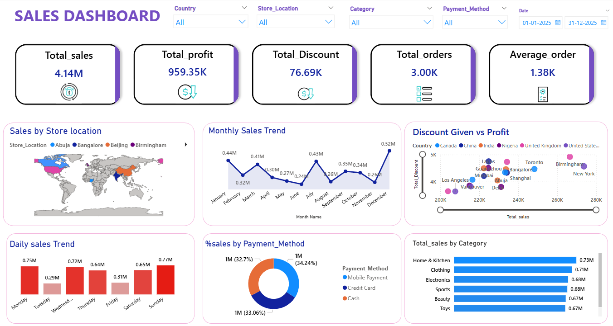

# Data Mart Insight — Sales Analytics Dashboard

## Overview

This project is a sales analytics dashboard built to analyze multi-region sales data and present key business insights through clear, interactive visuals. It covers the full data analyst workflow — from raw data cleaning in SQL to building a stakeholder-ready Power BI dashboard.

**Goal:** Turn scattered CSV sales data into actionable insights that support faster, better business decisions.

---

## Tools Used

| Tool | Purpose |
|------|---------|
| **Power BI** | Interactive dashboard & KPI visualizations |
| **SQL** | Data cleaning, transformation & aggregation |
| **Excel** | Initial data exploration |

---

## What I Did

- Cleaned and prepared multi-region sales data ex-UK,INDIA using SQL
- Built an interactive Power BI dashboard with filters for region, category, and date
- Analyzed revenue trends, top-performing categories, and regional comparisons
- Identified anomalies and outliers for business review

---

## Dashboard Preview



---

## Key Insights

- Q3 and Q4 consistently drove the highest revenue across both regions
- Top-performing categories contributed over 60% of total sales
- US and UK markets showed different Average Order Value patterns
- Some product categories showed declining units sold despite stable revenue — indicating price increases

---

## What I Achieved

- Converted raw CSV data into a clean, interactive dashboard stakeholders can use directly
- Demonstrated end-to-end analyst workflow: SQL → data prep → visualization → insights
- Strengthened skills in dashboard design, SQL aggregation, and business storytelling

---

## Project Structure

```
data-mart-insight/
├── Dataset/        # Raw sales CSV files (US & UK)
├── Sql_FIle/       # Data cleaning & analysis queries
├── Dashboard/      # Power BI file & screenshot
└── Assests/        # Supporting images
```

---

## Author

**Mohsin Zafar**  
GitHub: [mohsin-zafar](https://github.com/mohsin-zafar) | Email: mohsinzafar6398@gmail.com
